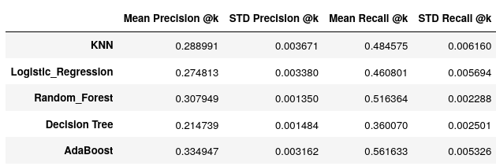
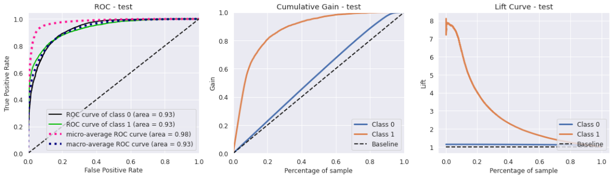

# Health Insurance Cross Sell: Insurance All

(Read this in English [here](README.md))

Aplicação de machine learning para tarefas de Learning to rank que permitiu a esta empresa faturar R$ 9,5 milhões em relação a utilização do modo de operação padrão.

## 1. Problema de Negócio: 

O time de negócios da empresa de seguros Insurance All identificou como uma possível fonte de receitas a venda complementar de seu mais novo produto aos clientes já segurados: um seguro de automóveis. Optando pelo contato com uma parte da sua carta de clientes via telefone, a empresa obteve relativo êxito em suas pesquisas, obtendo resultados tangíveis ao oferecer o seguro para 380 mil de seus clientes. O  elevado custo de operação porém, tornou a execução proibitiva para os 127 mil novos clientes que ainda não estão cientes da nova oferta. Assim, a empresa buscou a consultoria de uma empresa de dados, na esperança de que as informações constantes em seus bancos de dados sobre os clientes possam minimizar os custos, bem como responder a algumas perguntas.

Como um cientista contratado, cabe a resposta às perguntas:

* Quais os principais insights sobre os atributos mais relevantes de clientes interessados em adquirir um novo seguro de automóvel?
* Qual a porcentagem de clientes interessados em adquirir um seguro de  automóvel o time de vendas conseguirá contatar fazendo 20.000 ligações?
* E se a capacidade do time de vendas aumentar para 40.000 ligações, qual a porcentagem de clientes interessados em adquirir um seguro de automóvel o time de vendas conseguirá contatar?
* Quantas ligações o time de vendas precisa fazer para contatar 80% dos clientes interessados em adquirir um seguro de automóvel?

##  2 . Assunções de Negócio:

* Seja qual for a metodologia utilizada, o objetivo deve ser atingido utilizando somente os dados fornecidos pela empresa.
* Por simplicidade, foi considerado que toda a carta de clientes é residente no Brasil, motivo pelo qual os possíveis resultados de negócio serão expressos em **real brasileiro (R$)**.
* Considerando a aplicação da solução ao grupo de 127 mil novos clientes, apenas clientes com menos de 300 dias de contrato foram considerados.

### 2.1 - Sobre os dados

Os dados estão organzados em forma tabular tradicional. São registradas as seguintes informações:

* **Id**: Código Identificador único do Cliente (*int*)
* **Gender**: Gênero do cliente. (*str*)
* **Age**: Idade do cliente (*int*)
* **Driving License**: **0**, se o cliente não tem autorização legal para dirigir, ou **1**, caso contrário. (*int*)
* **Region Code**: Código de região do cliente. (*int*)
* **Vehicle Age**: Idade do veículo. (*str*)
* **Vehicle Damage**: **0**, se o veículo nunca sofreu dano nenhum; **1** caso contrário. (*int*)
* **Annual Premium**: Quantidade que o cliente pagou à empresa pelo seguro de saúde anual. (*float*)
* **Policy Sales Channel**: Código anônimo de canal de contato com o cliente. (*int*)
* **Vintage**: período em dias que o cliente se associou à empresa através da compra do seguro de saúde.(*int*)
* **Response**: **0**, caso o cliente não esteja interessado no seguro de automóvel; **1** caso contrário; (*int*)

Na ausência de dados separados específicos para uso como treino e teste, optou-se por dividir o dataset em partes menores que correspondem ao **treino, validação e teste** dos modelos, na proporção (estratificada):

|   Dados   | Proporção do Dataset(%) | Proporção do Dataset (#) |
| :-------: | :---------------------: | ------------------------ |
|  Treino   |           64            | 243909                   |
| Validação |           20            | 76222                    |
|   Teste   |           16            | 60978                    |

## 3. Planejamento de Solução

A Solução do modelo consistirá na utilização de modelos de machine learning para executar a tarefa conhecida como **Learning to Rank**, ou seja, criar uma lista ordenada de clientes interessados com base nos dados possuídos pela empresa.

Com foco primário na agilidade de entrega de resultados, a solução seguirá a metodologia **CRISP** aplicada à ciência de dados, com os ciclos sendo repetidos à medida em que forem necessários. Contextualmente, foi considerada a entrega rápida de resultados, seguidos de  rodadas de aprimoramento posteriores.

Com o intuito de trazer a solução para ajudar na tomada de decisão de negócio, a solução pensada consiste na execução dos seguintes passos enumerados abaixo:

0. **Aquisição de dados**: Aquisição dos dados do servidor Postgres remoto.

1. **Descrição dos dados**: Etapa onde será analisada a existência de dados errôneos/faltantes, tipo de dados e quantidade de informação para ser trabalhada.

2.  **Feature Engineering**: Criação de novas features com base nos dados para possibilitar a análise mais direta possível, bem como a criação de hipóteses que podem ajudar a entender mais sobre o problema e como resolvê-lo;
3. **Filtragem de Dados**: Remoção/substituição de valores não condizentes com o atributo selecionado.
4. **Análise Exploratória de Dados**: Análise dos dados, com foco na validação de hipóteses definidas no passo 2 e nas respostas de negócio demandadas pela contratante.
5. **Preparação de Dados**: Preparação dos dados para aplicação dos modelos de Machine Learning.
6. **Seleção de Features**: Escolha das features que sejam relevantes para a descrição do problema, manualmente e via funções apropriadas.
7. **Modelos de Machine Learning**: Avaliação direta dos modelos de machine learning utilizando métricas com validação cruzada;
8. **Ajuste fino de hiperparâmetros**: Otimização de parâmetros do modelo escolhido para treinamento;
9. **Modelo Final**:  Treinamento final do modelo de machine learning escolhido.
10. **Performance de negócio**: Solução das questões de negócio mediante a aplicação do modelo, com a presença de testes de generalização.
11. **Deploy do modelo final**: Deploy do modelo para utilização de maneira fácil e intuitiva para usuários de áreas não técnicas.

O deploy do modelo final será via api a ser construída, disponível em https://healthinsurancebot.herokuapp.com/predict e acessível via Google Sheets.

## 4. Top 5 Insights de Dados:

1. **98%** dos clientes interessados já tiveram seus veículos danificados;
2. Apenas **15%** dos interessados possui um veículo novo (com menos de 1 ano de uso), e apenas **10%** possuem o veículo a mais de 2 anos;
3. Em geral, clientes que já possuem seguros de automóvel **não estão** interessados na contratação do seguro da empresa (adesão de apenas 0,34%);
4. Clientes interessados possuem laços contratuais é igual ao de clientes não interessados.
5. A idade média de clientes interessados é **5 anos maior** que a de clientes não interessados

### 4.1 Perfil do cliente interessado no produto

Com base nos dados, podemos afirmar que o perfil de clientes interessados em adquirir o seguro é formado por:

**Homens (61%) e mulheres (39%) com idade aproximada de 43 anos, que possuem o veículo a ser segurado a menos de 2 anos (90%) e que já sofreram avarias em seus veículos.**

## 5. Modelos de Machine Learning Utilizados

### 5.1 Escolha do Modelo

No primeiro ciclo do CRISP para este projeto, foram utilizados os seguindes modelos de Machine Learning: 

* **K-Nearest Neighbors;**
* **Logistic Regression;**
* **Random Forest;**
* **Decision Tree;**
* **Extra Trees;**
* **ADABoost;**

A importância da sensibilidade do modelo em detectar e reconhecer não apenas quais clientes estariam interessados mas também a ordem de interesse dos mesmos levou à escolha das chamadas **Top K Measures** para a avaliação. Particularmente, o **Recall @K** foi tomada como principal métrica de avaliação. Após o processo de validação cruzada, obtivemos como resultados para os modelos:

 

O modelo escolhido foi o **ADABoost**. Após o ajuste fino de seus hiperparâmetros e de seu treinamento (validação cruzada, 10 folds), obtemos como métricas de resultado final:

### 5.2 Validação:

Outras métricas adequadas fora representadas graficamente afim de se ter uma maior compreensão da qualidade do modelo utilizado; aplicando o modelo aos dados de validação, obtemos as curvas de ganho, ROC e Lift abaixo:

**5.3 Testes de Generalização**

A aplicação do modelo nos testes de generalização apresentaram os seguintes resultados:

O ganho estimado e a porcentagem de interessados atingida por meio da aplicação do modelo aos dados de validação (ver passo 6 para contexto) se encontram na tabela abaixo:

| Qtd Ligações | Interessados (%) (Ligações Aleatórias) | Receita Líquida(R$) (Adesão - Custo) | Interessados(%) (Modelo aplicado) | Receita Líquida(R$) (Adesão - Custo) |
| :----------: | :------------------------------------: | ------------------------------------ | :-------------------------------: | ------------------------------------ |
|    20 mil    |                 26,65                  | 1.010.385,58                         |               86,33               | 12.782.243,86                        |
|   40 mill    |                 52,95                  | 3.937.464,66                         |               97,22               | 14.394.816,78                        |

## 6. Performance de Negócio

### 6.1 Contexto

O cálculo da receita gerada pela aplicação do modelo é feita com base nas estimativas:

* O período de execução do plano de vendas será de um mês. O custo de cada ligação é de **R$ 3,14**, gerando um custo total de **R$ 62.800,00** para o caso de 20 mil ligações e **R$ 125.600** para o caso de 40 mil ligações.
* Cada adesão ao serviço trará, anualmente, o valor de **R$ 1.577,86**,  o valor médio do seguro para os carros mais vendidos no Brasil no ano de 2021.
* Considerou-se que a carta dos 127 mil clientes ao qual o modelo será aplicado possui estritamente o mesmo comportamento dos dados que passaram pelas etapas anteriores.

### 6.2 Respostas:

* Quais os principais insights sobre os atributos mais relevantes de clientes interessados em adquirir um novo seguro de automóvel?

  * R: *As variáveis mais relevantes são: **vintage, annual premium, age, vehicle damage, region_code e policy sales channel**. Para mais insights, ver o **Passo 4***.

* Qual a porcentagem de clientes interessados em adquirir um seguro de  automóvel o time de vendas conseguirá contatar fazendo 20.000 ligações?

  * R: *Com base nos dados de teste, estima-se que o time de vendas alcance **90,4%** dos interessados na obtenção do seguro, garantindo uma receita líquida anual de **R$ 10.721.558,70**. É um resultado **8,71** vezes maior que o obtido usando o modelo de ligações aleatórias (Receita líquida anual de R$ 1.231.314,93).*

* E se a capacidade do time de vendas aumentar para 40.000 ligações, qual a porcentagem de clientes interessados em adquirir um seguro de automóvel o time de vendas conseguirá contatar?

  * R: *Ainda com base nos dados de teste, estima-se que o time de vendas alcance **98,7%** dos interessados na obtenção do seguro, garantindo uma receita líquida anual de **R$ 11.704.565,48**. É um resultado **2,33** vezes maior que o obtido usando o modelo de ligações aleatórias (Receita líquida anual de R$ 5.015.144,71).*

* Quantas ligações o time de vendas precisa fazer para contatar 80% dos clientes interessados em adquirir um seguro de automóvel?

  * R: *Com o modelo, estima-se que 80% dos interessados poderão ser alcnçados contactando **19,4%** dos clientes. Na figura abaixo, se encontra em destaque a curva de ganho do modelo aplicado aos dados de teste, com a linha amarela marcando o ponto em que o modelo alcança 80% dos interessados*:

    

## 7. Deploy

O deploy do modelo foi feito no serviço de nuvem **Heroku**, disponível atráves do endpoint https://healthinsurancebot.herokuapp.com/predict. Todo o pipeline de dados é aplicado a dados recebidos no formato JSON, a ser enviado a partir dos dados constantes em uma tabela com permissão para rodar o script `Google_script.gs`. As imagens abaixo demonstram o uso da ferramenta.

## 8. Conclusões e Lições Aprendidas

* Modelos de Learning to Ranking é um tipo especial de classificação e, como tal, precisam de métricas específicas para avaliação de performance. Do ponto de vista de negócio, a ordenação é capaz de identificar potenciais clientes e auxiliar enormemente na geração de receita e na redução de custos. Isto é importante especialmente em seguradoras, cujo modelo de negócio precisa da geração de altos valores de receitas para permitir não apenas atender seus clientes em caso de infortúnios, mas também para obter o lucro líquido tangível por meio de ativos de investimento.
* Uma configuração que a feature apresenta no espaço de dados tende a ser mais favorável para tarefas de classificação conforme sua capacidade de separação de pontos; Nos casos em que isso não seja facilmente identificável, os métodos que possuem maior flexibilidade podem oferecer melhores resultados.
* O desbalanço do  conjunto de dados pode afetar significativamente o processo de aprendizado do modelo. Em geral, modelos que treinam com conjuntos de dados balanceados oferecem melhores resultados que a sua contraparte treinada em dados que não o são;

## 9. Próximos Passos

Para o Segundo ciclo do projeto, são definidos como próximos passos imediatos:

* **Criar novas features** que possam trazer mais explicabilidade ao modelo e facilitar o processo de classificação, com base nos feedbacks recebidos a partir dos stakeholders.
* **Investigar hipóteses não testadas no passo 4**, marcadas diretamente. 
* **Utilizar diferentes técnicas de balanceamento e encoding de variáveis**, procurando garantir a melhor performance dos resultados. 
* **Testar diferentes modelos de Machine Learning**, que possam apresentar maior sensibilidade aos dados oferecidos.
* **Apresentar novas métricas de negócio**, que possam traduzir mais rápido o benefício da utilização do modelo em detrimento de chamadas aleatórias.

## 10. Agradecimentos e Informações Adicionais

* Sobre os preços dos seguros de automóveis: https://autopapo.uol.com.br/curta/preco-seguro-carros-mais-vendidos/
* Sobre o modelo de negócio de seguradoras: https://www.investopedia.com/ask/answers/052015/what-main-business-model-insurance-companies.asp
* Sobre diferentes tipos de encoding de variáveis categóricas: https://towardsdatascience.com/all-about-categorical-variable-encoding-305f3361fd02

Registro aqui os agradecimentos à toda a [Comunidade Data Science](https://sejaumdatascientist.com/) pelos insights, discussões e explicações sobre a criação e manutenção do projeto.

