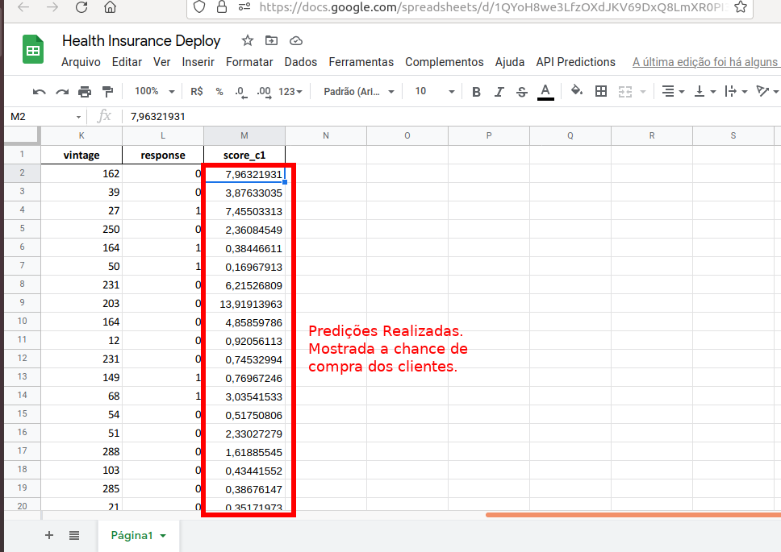

# Health Insurance Cross Sell: Insurance All

(Leia este README em Português [aqui](README-ptbr.md))

A machine learning application for learning to rank that increased the business revenue in 9.5 millions Brazilian real

## 1. Business Problem

The Insurance All business team has identified as a new possible income the selling of their newest product to the already insured clients: a car insurance. Contacting some clients via phone calls, the company achieved relative success with solid results after offering the product to approximately 380 thousand clients. However, the high operation costs made the operation execution prohibitive for the 127 thousand new clients that are not aware of the offer yet. Thus, the company searched for a data science consultancy, hoping that the clients' data in their database  could help to minimize the costs, and answer some questions.

As a hired data scientist, you have to answer the questions:

* Among all the features gathered, which show more evidence of intent of the customers to purchase the car insurance?
* If the sales team is able to make 20.000 calls, which fraction of the interested customers will be reached?
* If the sales team is now able to make 40.000 calls, which fraction of the interested customers will be reached?
* How many calls does the sales team need to make in order to reach 80% of the interested customers?

## 2. Business Assumptions

* Whatever the chosen methodology , the objective has to be achieved using only the company's data.
* By simplicity, we are considering that all clients are resident in Brazil, and because this the business results are expressed in **Brazilian real (R$)**.
* Considering the solution application in the 127 thousand new clients, only the data about clients with less than 300 contract days was used. 

### 2.1 The data

The data aore organized in traditional tabular form. The features are:

* **Id**: Unique identifier code (*int*)

* **Gender**: Client gender. (*str*)

* **Age**: client age (*int*)

* **Driving License**: **0**,  if the client has legal permission to drive, or **1** otherwise. (*int*)

* **Region Code**: The client region code. (*int*)

* **Vehicle Age**: The age of the client's vehicle. (*str*)

* **Vehicle Damage**: **0**, if the client has not damaged his vehicle,or **1** otherwise. (*int*)

* **Annual Premium**: the amount paid by client to company for health insurance. (*float*)

  **Policy Sales Channel**: the client anonymous contact code (*int*)

* **Vintage**: time period that the client is associated with the insurance company. (*int*)

* **Response**: **0** if the client has no interest in the car insurance, or **1** otherwise; (*int*)

In the ausence of specific train and test data, the strategy used was divide the entire dataset in minor parts that will be correspont to **train, test and validation**, in the (stratified) proportion:

|    Data    | Dataset Proportion(%) | Dataset Proportion(#) |
| :--------: | :-------------------: | --------------------- |
|   Train    |          64           | 243909                |
| Validation |          20           | 76222                 |
|    Test    |          16           | 60978                 |

## 

## 3. Solution Planning

the solution of this problem consists in the use a machine learning model to perform **Learning to Rank** task, i.e., create a sorted list with interested clients on the top from the original data.

Focusing primarily in feedback agility, the solution will follow the CRISP methodology applied to data science, with the cycles being repeated as necessary.

Aiming that souloution helps in business decision-making, the solution will follow the steps ahead:

0. **Data Aquisition**: data aquisition from a remote Postgres server;
1. **Data Description**: In this step we can analyze if there are erroneous/missing data, data types and general information about the data who we will working.
2. **Feature Engineering**: The creation of new features  based in the data to facilitate the most directly analysis as possible. Also, at this point we  formulate some hypothesis searching understand new and until now unseen clients behaviors.
3. **Data Filtering**: In this step, we will filter the data with values different from the feature description and decide how to treat them.
4. **Exploratory Data Analysis**: Data validation focusing in the validation of hypothesis formulated in step 2 and the business questions proposed initially. 
5. **Data Preparation**: Data preparation for machine learning algorithms application.
6. **Feature Selection **: Relevant feature selection,manually (based in EDA step) and using other technical approaches.
7. **Machine Learning Models**: Direct comparison between various machine learning models by using cross validation metrics.
8. **Fine Tunning Hyperparameters**: The chosen model's parameters otimization.
9. **Final Model**: Chosen final model training.
10. **Business Performance**: Generalization tests and business answer obtained via model use.
11. **Deploy**: Model deploy for easy and intuitive use mainly by non-technical stakeholders.

The final model deploy will be by an API to be build and available at https://healthinsurancebot.herokuapp.com/predict . Initially, the API will be effectivelly via Google Sheets.

## 4. Top 5 data insights

1. **98%** of interested customers have already damaged they vehicles.
2.  Only **15%** of  interested customers own a new vehicle (less than 1 year of use), and only **10%** own the vehicle for more than 2 years.
3. In general customers that already insured **are not** interested in the new car insurance product.
4. Interested clients have  the same insurance contract period that the not interested clients.
5. The interested clients mean age is **5 years older** than the not interested clients.

### 4.1 Interested clients profile

Basing on data, we can infer that interested client profile is made by:

**Men (61%) and Women (39%) with approximately 43 years old that owns the not insured vehicle for less than 2 years and have damaged their vehicles.**

## 5. Model Learning Models

### 5.1 Model Choice

At the first CRISP cycle for this project, the following models was tested:

* **K-Nearest Neighbors;**
* **Logistic Regression;**
* **Random Forest;**
* **Decision Tree;**
* **Extra Trees;**
* **ADABoost;**

The importance of model sensitivity in detecting and recognizing not only which client would be interested, but also their order of interest led the choice of the called **Top K Measures** for evaluation. Mainly, the **Recall @K** metric was taken as the evaluation metric. After cross validation process, we obtained the following results:

The chosen model was **ADABoost**. After the hyperparameter fine tunning and training (cross validation, 10 folds), the final result was:

### 5.2 Validation

Other appropriated metrics were graphically represented aiming the major comprehension of the chosen model  performance. Applying the model in the validation data, we obtain the **cumulative gain curve, the ROC curve and the Lift curve**:

**5.3 Generalization Tests**

The model applied to the test data brings out the  following results:

The estimated revenue and interested percentage reached by model application to the validation data (i.e., **Recall @K**, see the next topic for context) are found in the next table:

| Calls(#) | Interested (%) (Random Calls) | Revenue (R$) (Insurances - Costs) | Interested(%) (Model Recall@K) | Revenue(R$) (Insurances - Costs) |
| :------: | :---------------------------: | :-------------------------------: | :----------------------------: | :------------------------------: |
|   20 K   |             26.65             |           1,010,385.58            |             86.33              |          12,782,243.86           |
|   40 K   |             52.95             |           3,937,464.66            |             97.22              |          14,394,816.78           |

## 6. Business Performance

### 6.1 Context

The generated revenue applied model is based in the following estimates:

* Each call made  for selling the car insurance costs approximately **R$ 3.14**. The total costs are **R$ 62,800.00** in the case of 20 thousand calls, and **R$ 125,600.00** in the case of 40 thousand calls.
* Every successful sell brings annually the total **R$ 1,577.86** (the averaged value for a car insurance, considering the most sold cars in Brazil over 2020).
* The 127 thousand new customers which the model will be applied have strictly the same behavior as the customers analyzed in the used dataset.

### 6.2 Answers

* Among all the features gathered, which show more evidence of intent of the customers to purchase the car insurance?
  * A: *The most relevant features are: **vintage, annual premium, age, vehicle damage, region_code e policy sales channel** (For more insights, see the **step 4**).*
* If the sales team is able to make 20.000 calls, which fraction of the interested customers will be reached?
  * A: *Based in the test dataset, the estimates are that the sales team reach **90.4%** of interested customers, granting a annual revenue of **R$ 10,721,558.70**. This revenue is approximately **8,71** times bigger than baseline (random) model (a R$ 1,231,314.93 revenue).*
* If the sales team is now able to make 40.000 calls, which fraction of the interested customers will be reached?
  * A: *Based in the as previous question, the interested percentage reached is **98.7%**, and the annual revenue will be **R$ 11,704,565.48**. At this time, however, this result is approximately better than baseline (random) model (a R$ 5,015,144.71 revenue).*
* How many calls does the sales team need to make in order to reach 80% of the interested customers?
  * Using the model, the estimates points that 80% of the interested customers can be reached calling only **19.4%**. In the figure below are represented the cumulative gains curve, where the red line marks the interested customers, and yellow line shows the point that 80% is reached.

## 7. Deploy

The model deploy was made in the **Heroku** service, available by endpoint https://healthinsurancebot.herokuapp.com/predict. The data pipeline is applied to received data in JSON format, sent from a Google Sheet with permission to run the script  `Google_script.gs`. The images below show the model predicting some example data.

## 8. Conclusions and Lessons Learned

* Learning to Rank models are a special type of classification tasks, and because of this, needs specific metrics to evaluate performance. In business point of view, the ranking list is capable to identify potential customers and helps greatly in revenue generation an costs reduction. This is important specially in insurance companies, where the business model is based in collecting large amount of revenue aiming not only attend customers when necessary, but obtaining profit from other investment assets.
* The configuration that a feature presents can facilitate the classification process, and tends to be better as clear the separation in feature data space.  In cases where this is not so clear, more flexible models (i.e. models that present a good variance) can be useful if the data outliers are treated appropriately.
* The imbalance of the dataset can significantly affect the machine learning process. Is common sense that models that train with balanced data in general presents better results in comparison with their counterpart.

## 9. Next Steps

In the next CRISP cycle, the firsts steps are:

* **Create new features** that help to bring more explainability and make ranking task easier, based in the stakeholders feedbacks.

* **Investigate net tested hypothesis in step 4.**

* **Use different data encodings and data balancing**, aiming bring the best models performance;

* **Test new machine learning models** and analyze its sensitivity to data.

* **Present new business metrics** to help the understanding of the model benefits.

  

## 10. Additional Information: 

* Information about car insurance prices in Brazil: https://autopapo.uol.com.br/curta/preco-seguro-carros-mais-vendidos/
* About insurance companies business model: https://www.investopedia.com/ask/answers/052015/what-main-business-model-insurance-companies.asp
* More about different encoding types: https://towardsdatascience.com/all-about-categorical-variable-encoding-305f3361fd02

My all thanks to the excellent **[Comunidade Data Science](https://sejaumdatascientist.com/)** for the discussions about this project insights and maintenance

